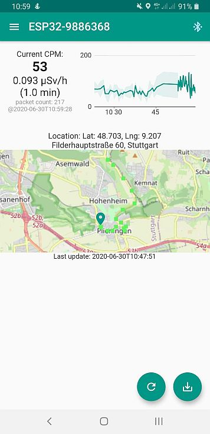

# multigeigercompanion

MultiGeiger companion app for mobile radiation measurements

## Getting Started with Flutter

A few resources to get you started if this is your first Flutter project:

- [Lab: Write your first Flutter app](https://flutter.dev/docs/get-started/codelab)
- [Cookbook: Useful Flutter samples](https://flutter.dev/docs/cookbook)

For help getting started with Flutter, view the
[online documentation](https://flutter.dev/docs), which offers tutorials,
samples, guidance on mobile development, and a full API reference.

If you have Flutter up and running the demo successfully, clone this repository, connect your device and execute

```
flutter run  
```


## Getting Started with MultiGeiger Companion

Some links:
* Project overview, hardware and embedded ESP32 based firmware development: <br>https://github.com/ecocurious2/MultiGeiger
* Map with Multigeiger data: <br>https://multigeiger.citysensor.de/
* Ecocurious: <br>https://ecocurious.de/
* TTN Region Stuttgart / IoT Makers Region Stuttgart e.V.: <br>https://www.thethingsnetwork.org/community/region-stuttgart/

This app:
* collects data from connected MultiGeiger via Bluetooth®
* displays the data in a chart
* aggregates the data
  * when a certain time (default: 5 min) has passed, or
  * when the location changes (default: ~10 m difference for new position update) <br>AND more than a minimum (default: 3) of count rate packets were registered
* sets a marker for every new data aggregation
* shows current position and markers on a map

The current marker collection is not stored on the mobile device, but can be sent via the floating action button by mail.

Screenshot:




## Bluetooth® Communication
### BLE Heart Rate Service

The MultiGeiger provides a Bluetooth® Low Energy (BLE) service to allow the collection of the Geiger-Mueller count rate
via a [GATT Heart Rate Service](https://www.bluetooth.com/specifications/gatt/services/>) (Service UUID 0x180D).

The following characteristics are used:

- 0x2A37 ('Heart Rate Measurement Characteristic'):
  - The first byte is a collection of status flags, according to the service's standard
  - 'Heart Rate Measurement' as 16 bit value (little endian), corresponds to Geiger-Mueller counts per minute (CPM)
  - 'Energy Expenditure' as 16 bit value (little endian), represents a rolling packet counter
- 0x2A38 ('Heart Rate Sensor Position Characteristic')
  - 'Sensor Position' as 8 bit value, corresponds to TUBE-TYPE, allowing the conversion of CPM to radiation rate
- 0x2A39 ('Heart Rate Control Point Characteristic')
  - Write characteristic, required by service's standard to reset Energy Expenditure to 0. Writing 0x01 resets the rolling packet counter to 0.


